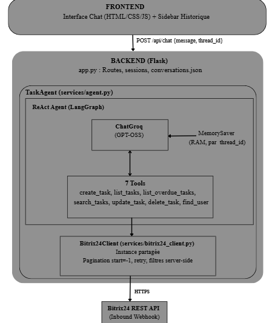
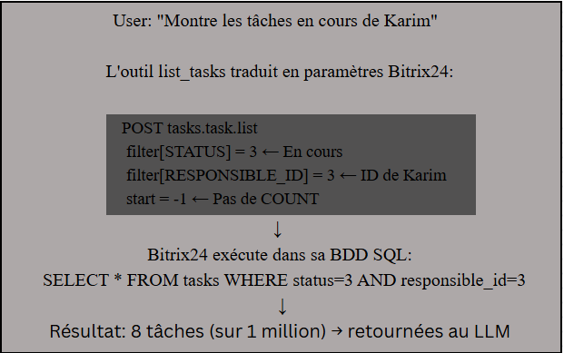

# Agent Bitrix24

Agent conversationnel connecté à l'API Bitrix24, capable de gérer des tâches (CRUD) en langage naturel.
L'agent interprète les requêtes, résout les dépendances entre outils de manière autonome, et interagit avec Bitrix24 via un client API.

---

## Table des matières

1. [Présentation et technologies](#1-Présentation-et-technologies)
2. [Architecture de l'agent](#2-architecture-de-lagent)
3. [Le pattern ReAct — Boucle décisionnelle](#3-le-pattern-react--boucle-décisionnelle)
4. [Les 7 outils de l'agent](#4-les-7-outils-de-lagent)
5. [Composants clés du code](#5-composants-clés-du-code)
6. [Client API Bitrix24 — Pagination et filtrage](#6-client-api-bitrix24--pagination-et-filtrage)
7. [Gestion de la mémoire conversationnelle](#7-gestion-de-la-mémoire-conversationnelle)
8. [Interface utilisateur](#8-interface-utilisateur)
9. [Installation et configuration](#9-installation-et-configuration)
10. [Structure du projet](#10-structure-du-projet)
11. [API REST du serveur Flask](#11-api-rest-du-serveur-flask)

---


## 1. Architecture de l'agent

<p align="center">
  
</p>

## 2.Technologies utilisées

| Couche | Technologie | Rôle |
|---|---|---|
| Frontend | HTML, CSS, JavaScript | Interface chat avec sidebar d'historique |
| Backend | Flask | API REST, sessions |
| Agent | LangGraph | Orchestration ReAct des outils |
| LLM | Groq API (multi-modèles) | Raisonnement et tool calling |
| API externe | Bitrix24 REST (webhook) | CRUD tâches + recherche utilisateurs |
| Mémoire | MemorySaver (RAM) + JSON (disque) | Contexte conversationnel + historique |

## 3. Les principaux composants de LangGraph

| Composant | Rôle | Exemple dans l'agent |
|---|---|---|
| **LLM / ChatModel** | Le cerveau qui génère du texte | ChatGroq(model="openai/gpt-oss-120b") |
| **Prompt Template** | Instructions données au LLM | SYSTEM_PROMPT dans `prompt.py` |
| **Tools** | Fonctions que le LLM peut appeler | list_tasks, create_task, find_user, etc. |
| **Memory** | Garder le contexte conversationnel | MemorySaver() |

L'agent est créé et configuré suivant une architecture ReAct avec une mémoire conversationnelle.

```python
from langchain_groq import ChatGroq                  # LLM via Groq (gratuit)
from langgraph.prebuilt import create_react_agent     # Agent ReAct (graphe cyclique)
from langgraph.checkpoint.memory import MemorySaver   # Mémoire par thread

class TaskAgent:
    def __init__(self):
        self.memory = MemorySaver()                   # Stockage en RAM
        llm = ChatGroq(model="openai/gpt-oss-120b")
        self.agent = create_react_agent(
            model=llm,                                # Le LLM qui raisonne
            tools=ALL_TOOLS,                          # 7 outils disponibles
            prompt=SYSTEM_PROMPT,                     # Instructions de comportement
            checkpointer=self.memory,                 # Mémoire par thread_id
        )
```

- checkpointer=self.memory : sauvegarde automatiquement l'état (messages) après chaque nœud du graphe.
- thread_id dans le config : isole la mémoire de chaque conversation.

Cette architecture offre trois avantages :

1. **Gestion du contexte :**  `MemorySaver` avec `thread_id` gère automatiquement le contexte conversationnel par session.
2. **Graphe cyclique :** : Le LLM enchaîne plusieurs outils de manière autonome (Par exemple: l'agent peut d'abord utiliser `find_user` pour retrouver un utilisateur, puis appeler `create_task` avec l'ID obtenu.).
3. **Extensibilité :** la structure de LangGraph permet d'ajouter par la suite des étapes supplémentaires (une validation avant une opération sensible).


### 3.1 Groq (LLM gratuite et stratégie multi-modèles)

L’exécution des modèles LLM est réalisée avec Groq (gratuit). L’utilisation de l’infrastructure LPU de Groq permet d’obtenir des temps de réponse rapides. Le tool calling est également utilisé afin que le modèle puisse sélectionner et appeler les fonctions disponibles dans l’agent.

Pour garantir la disponibilité continue, l'application propose **3 modèles** accessibles via un sélecteur dans l'interface :


| Modèle | Taille | Fournisseur | Rôle |
|---|---|---|---|
| **GPT-OSS 120B** (défaut) | 120B | OpenAI (open-source) | Modèle principal |
| **GPT-OSS 20B** | 20B | OpenAI (open-source) | Fallback rapide et léger |
| **Qwen 3.6 27B** | 27B | Alibaba | Alternative avec bon raisonnement |

Les modèles disponibles utilisé sont soumis à des limites de requêtes et de tokens. Si une requête retourne une erreur 429, l'agent détecte l'erreur et invite l'utilisateur à basculer vers un autre modèle pour poursuivre la conversation. 

### 3.2 Les 7 tools de l'agent

Chaque outil est défini avec `@tool` de LangChain. Le LLM lit le **docstring** de chaque outil pour décider quand et comment l'appeler.

#### 3.2.1 create_task

Crée une tâche avec résolution intelligente des dates et des assignees.

| Paramètre | Description |
|---|---|
| title |Titre de la tâche (obligatoire) |
| assignee_name |Prénom de l'assignee (résolu automatiquement en ID) |
| deadline | Date en langage naturel ("vendredi", "lundi prochain") |
| priority | "low", "normal", "high" |
| group_name | Nom du projet/groupe |
| tags |  Tags séparés par des virgules |

L'outil résout les dates relatives ("vendredi", "demain") en dates ISO via `python-dateutil`.

#### 3.2.2 list_tasks

Liste les tâches avec **filtres server-side** envoyés à l'API Bitrix24.

| Paramètre| Description |
|---|---|
| status  | "new", "pending", "in_progress", "completed", "deferred" |
| assignee_name| Filtrer par assignee |
| group_name | Filtrer par projet |
| limit  | Nombre max de résultats |

Les filtres sont traduits en paramètres API (`RESPONSIBLE_ID`, `STATUS`, `GROUP_ID`) et envoyés avec la requête. Bitrix24 filtre dans sa base de données SQL avant de retourner les résultats.

#### 3.2.3 list_overdue_tasks

Liste les tâches en retard (deadline passée, non terminées). Utilise le filtre `<DEADLINE: now()` + `!STATUS: 5`.

#### 3.2.4 search_tasks

Recherche par mot-clé dans le titre via le filtre Bitrix24 `%TITLE%`.

#### 3.2.5 update_task

Modifie une tâche existante. Champs modifiables : titre, description, status, deadline, priorité, assignee, groupe, tags.

Exemple de flux pour `« Repousse la tâche 12 à lundi et mets-la en haute priorité »` :

```
Boucle:
  AGENT → analyse la requête, identifie: task_id=12,   deadline="lundi", priority="high"
         → tool_call: update_task(
             task_id=12,
             deadline="lundi",    # résolu en ISO: "2026-08-18T18:00:00"
             priority="high"      # traduit en code Bitrix24: 2
           )
  TOOLS → exécute:
         bitrix24_client.update_task(12, {
             "DEADLINE": "2026-08-18T18:00:00",
             "PRIORITY": 2
         }) → Bitrix24 API 

Sortie:
  AGENT → "Tâche #12 mise à jour : deadline → lundi 18/08, priorité → haute"

```

L'outil résout les dates relatives et traduit les priorités textuelles en codes numériques avant d'appeler l'API.

#### 3.2.6 delete_task

Supprime une tâche par son ID.

#### 3.2.7 find_user

Cherche un utilisateur par prénom ou nom de famille. Retourne l'ID, le nom complet et l'email. Utilisé implicitement par les autres outils quand l'utilisateur mentionne un prénom.

---

### 3.3 Gestion de la mémoire conversationnelle

#### Deux niveaux de mémoire

| Niveau | Stockage | Persistance | Contenu |
|---|---|---|---|
| **MemorySaver** | RAM (dict Python) | Perdu au redémarrage | Messages LLM par `thread_id` |
| **conversations.json** | Fichier disque | Persiste au redémarrage | Titres, dates, messages affichés |

### MemorySaver — Contexte LLM

Le checkpointer `MemorySaver` sauvegarde automatiquement tous les messages (user, AI, tool) après chaque nœud du graphe. Chaque `thread_id` a son propre historique isolé.

```python
# L'agent charge automatiquement la mémoire du thread
result = agent.invoke(
    {"messages": [{"role": "user", "content": message}]},
    config={"configurable": {"thread_id": thread_id}}
)
```

Cela permet les références contextuelles :

```
User: "Crée une tâche : vérifier le scanner"
Bot:  "Tâche #15 créée"
User: "Change son titre en 'vérifier les imprimantes'"
       ↑ Le LLM sait que "son" = tâche #15 grâce à la mémoire
```

### conversations.json — Historique persisté

L'historique de la sidebar est sauvegardé sur disque pour survivre aux redémarrages. Seules les conversations avec au moins 1 message sont affichées.

### Auto-recovery

Si l'historique en mémoire est corrompu (ex: changement de compte Bitrix24 mid-session), l'agent détecte l'erreur `INVALID_CHAT_HISTORY`, efface la mémoire du thread concerné, et réessaie automatiquement.

---


## 4. Client Bitrix24
Un seul `Bitrix24Client()` est partagé par tous les outils :

- **Réutilise la session HTTP** (TCP keep-alive) → évite de recréer une connexion à chaque appel.
- **Centralise le rate limiting** → un seul point de contrôle du débit API.
- **Simplifie la configuration** → le webhook est défini à un seul endroit (`.env`).

Le client est **stateless** : chaque appel API est indépendant, donc il n'y a pas de conflit en cas d'accès concurrent.

- Il est également optimisé pour les gros volumes de données grâce à 3 techniques :

1. **Pagination avec `start=-1` + filtre `>ID`** (pas de `COUNT`) → complexité O(1) par page au lieu de O(n).
2. **Filtrage server-side** (status, assignee, group) → Bitrix24 filtre dans sa BDD SQL, pas Python en mémoire. Sur 1M de tâches avec filtre : 1 page vs 20 000 pages.
3. **Retry avec exponential backoff** (1s, 2s, 3s) → gère les erreurs `QUERY_LIMIT_EXCEEDED` (429).

**Exemple concret de filtrage server-side** :

<p align="center">
  
</p>
Sur 1 million de tâches, si le filtre retourne 8 résultats :
- **Sans filtre server-side** : 20 000 pages × 50 résultats à télécharger, puis Python filtre → très lent
- **Avec filtre server-side** : 1 seule page de 8 résultats directement → rapide

**Exemple concret de pagination** :

```
  Page 1: filter[>ID] = 0   → reçoit tâches ID 1 à 50
  Page 2: filter[>ID] = 50  → reçoit tâches ID 51 à 100
  Page 3: filter[>ID] = 100 → reçoit tâches ID 101 à 130 (fin)
  
  Total: 3 requêtes pour 130 résultats (filtrés par la BDD)

```


## 8. Interface utilisateur

- **Thème** : Dark grey premium avec design sombre épuré.
- **Sidebar** : Historique des conversations avec suppression (icône trash au hover).
- **Exemples catégorisés** : Suggestions de commandes organisées par catégorie (Gestion, Recherche, Modification) pour guider l'utilisateur.
- **Responsive** : Sidebar escamotable sur mobile.
- **Sélecteur de modèle** : Changement de LLM en temps réel (GPT-OSS 120B, GPT-OSS 20B, Qwen 3.6).
- **Indicateur de connexion** : Vérifie le webhook Bitrix24 au démarrage et affiche le nom de l'utilisateur connecté.

---

## 9. Installation et configuration

### Prérequis

- Python 3.10+
- Un compte Bitrix24 avec un webhook entrant (inbound webhook) avec les permissions `task` et `user`
- Une clé API Groq gratuite — [console.groq.com](https://console.groq.com)

### Installation

```bash
git clone <url-du-repo>
cd App5
pip install -r requirements.txt
```

### Configuration

Créer un fichier `.env` à la racine :

```env
BITRIX24_WEBHOOK_URL=https://votre-domaine.bitrix24.com/rest/1/votre-cle/
GROQ_API_KEY=gsk_votre_cle_groq
```

### Lancement

```bash
python app.py
```

Ouvrir [http://localhost:5000](http://localhost:5000) dans le navigateur.